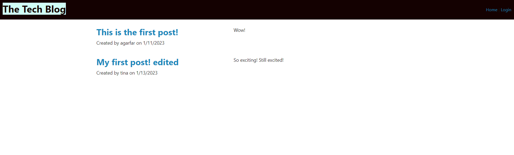

# Tech Blog

## Description

This application allows the user to create/sign into a personal account, at which point they may create posts or leave comments on existing posts. Users signed into the application also have the option to edit or delete their own posts. Remaining idle for an extended time requires the user to log back in before being able to post or add comments. 

## Table of Contents 

- [Installation](#installation)

- [Usage](#usage)

- [License](#license)

- [Contributing](#contributing)

- [Tests](#tests)

- [Questions](#questions)

## Installation

Before running the application, make sure you have installed the packages listed in the package.json file. Navigate to the repository in the terminal and run 'npm i' to install. Make sure you have MySQL installed locally and input your database credentials - DB_USER, DB_PASSWORD, DB_NAME - in a .env file. Use the provided seeds and schema to prepopulate your database for testing.

## Usage

After running the application with 'npm run start' or navigating to the deployed Heroku application, the user is presented with the blog homepage. From here, clicking on the 'login' link sends the user to the login/signup page, where they may create an account if they have not already done so. After logging in, the user can click on an existing post and is presented with an option to leave a comment. Clicking on the 'dashboard' link in the nav bar brings the user to their personal profile, where they may select the option to create a new post or click on one of their existing posts to either edit the content or delete the post entirely. Remaining idle in the application for too long requires the user to log back in. At any point, the user can choose to logout, at which point they are brought back to the homepage.

## License

This project is covered under the MIT license.

## Contributing

N/A

## Tests

N/A

## Questions

Github Profile: https://github.com/agarfar

Please address all questions regarding this project to the following email: antfar67@gmail.com